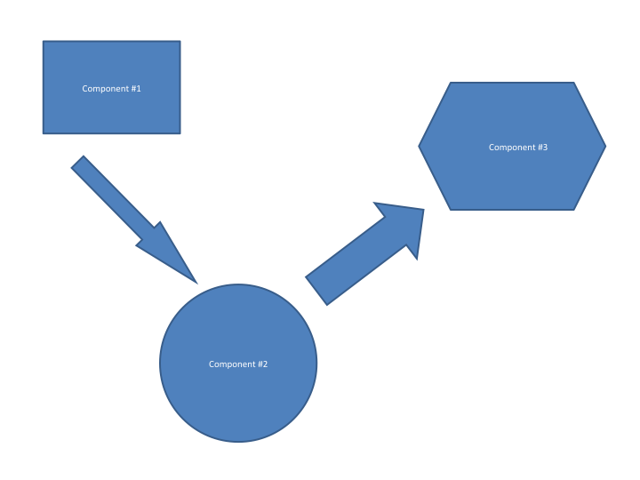

.. role:: math(raw)
   :format: html latex
..

.. role:: raw-latex(raw)
   :format: latex
..

Design and Implementation
=========================

Systems Goals
-------------

Briefly describe the overall goals this system plans to achieve. These
goals are typically provided by the stakeholders. This is not intended
to be a detailed requirements listing. Keep in mind that this section is
still part of the Overview.

System Overview and Description
-------------------------------

Provide a more detailed description of the major system components
without getting too detailed. This section should contain a high-level
block and/or flow diagram of the system highlighting the major
components. See Figure [systemdiagram]. This is a floating figure
environment. LaTeX will try to put it close to where it was typeset but
will not allow the figure to be split if moving it can not happen.
Figures, tables, algorithms and many other floating environments are
automatically numbered and placed in the appropriate type of table of
contents. You can move these and the numbers will update correctly.

   A sample figure .... System Diagram [systemdiagram]

Major System Component #1
~~~~~~~~~~~~~~~~~~~~~~~~~

Describe briefly the role this major component plays in this system.

Major System Component #2
~~~~~~~~~~~~~~~~~~~~~~~~~

Describe briefly the role this major component plays in this system.

Major System Component #3
~~~~~~~~~~~~~~~~~~~~~~~~~

Describe briefly the role this major component plays in this system.

Technologies Overview
---------------------

This section should contain a list of specific technologies used to
develop the system. The list should contain the name of the technology,
brief description, link to reference material for further understanding,
and briefly how/where/why it was used in the system. See
Table [somenumbers]. This is a floating table environment. LaTeX will
try to put it close to where it was typeset but will not allow the table
to be split.

+---------------+---------------+
| 7C0           | hexadecimal   |
+---------------+---------------+
| 3700          | octal         |
+---------------+---------------+
| 11111000000   | binary        |
+---------------+---------------+
| 1984          | decimal       |
+---------------+---------------+

Table: A sample Table ... some numbers. [somenumbers]

Architecture and System Design
------------------------------

This is where you will place the overall system design and the
architecture. This section will be very detailed and should be image
rich. There is the old phrase *a picture is worth a thousand words*, in
this class it could be worth hundreds of points (well if you sum up over
the entire team). One needs to enter the design and why a particular
design has been done. THIS IS THE CORE OF THE COURSE.

*It is important for you to say why as much as what.*

Design Selection
~~~~~~~~~~~~~~~~

Failed designs, design ideas, rejected designs here.

Data Structures and Algorithms
~~~~~~~~~~~~~~~~~~~~~~~~~~~~~~

Describe the special data structures and any special algorithms.

Data Flow
~~~~~~~~~

Communications
~~~~~~~~~~~~~~

Classes
~~~~~~~

UML
~~~

UX
~~

UI
~~

MVVM, etc
~~~~~~~~~

Major Component #1
-------------------

**If the following makes sense, use this outline, if not then modify the
outline**

This section is used to describe the design details for each of the
major components in the system. Note that this chapter is critical for
all tracks. Research tracks would do experimental design here where
other tracks would include the engineering design aspects. This section
is not brief and requires the necessary detail that can be used by the
reader to truly understand the architecture and implementation details
without having to dig into the code.

Technologies Used
~~~~~~~~~~~~~~~~~

This section provides a list of technologies used for this component.
The details for the technologies have already been provided in the
Overview section.

Component Overview
~~~~~~~~~~~~~~~~~~

This section can take the form of a list of features.

Phase Overview
~~~~~~~~~~~~~~

This is an extension of the Phase Overview above, but specific to this
component. It is meant to be basically a brief list with space for
marking the phase status.

Architecture Diagram
~~~~~~~~~~~~~~~~~~~~~

It is important to build and maintain an architecture diagram. However,
it may be that a component is best described visually with a data flow
diagram.

Data Flow Diagram
~~~~~~~~~~~~~~~~~

It is important to build and maintain a data flow diagram. However, it
may be that a component is best described visually with an architecture
diagram.

Design Details
~~~~~~~~~~~~~~

This is where the details are presented and may contain subsections.
Here is an example code listing:

::

    #include <stdio.h>
    #define N 10
    /* Block
     * comment */

    int main()
    {
        int i;

        // Line comment.
        puts("Hello world!");

        for (i = 0; i < N; i++)
        {
            puts("Python is also great for programmers!");
        }

        return 0;
    }

This code listing is not floating or automatically numbered. If you want
auto-numbering, but it in the algorithm environment (not algorithmic
however) shown above.

Major Component #2
-------------------

Technologies Used
~~~~~~~~~~~~~~~~~

This section provides a list of technologies used for this component.
The details for the technologies have already been provided in the
Overview section.

Component Overview
~~~~~~~~~~~~~~~~~~

This section can take the form of a list of features.

Phase Overview
~~~~~~~~~~~~~~

This is an extension of the Phase Overview above, but specific to this
component. It is meant to be basically a brief list with space for
marking the phase status.

Architecture Diagram
~~~~~~~~~~~~~~~~~~~~~

It is important to build and maintain an architecture diagram. However,
it may be that a component is best described visually with a data flow
diagram.

Data Flow Diagram
~~~~~~~~~~~~~~~~~

It is important to build and maintain a data flow diagram. However, it
may be that a component is best described visually with an architecture
diagram.

Design Details
~~~~~~~~~~~~~~

This is where the details are presented and may contain subsections.

Major Component #3
-------------------

Technologies Used
~~~~~~~~~~~~~~~~~

This section provides a list of technologies used for this component.
The details for the technologies have already been provided in the
Overview section.

Component Overview
~~~~~~~~~~~~~~~~~~

This section can take the form of a list of features.

Phase Overview
~~~~~~~~~~~~~~

This is an extension of the Phase Overview above, but specific to this
component. It is meant to be basically a brief list with space for
marking the phase status.

Architecture Diagram
~~~~~~~~~~~~~~~~~~~~~

It is important to build and maintain an architecture diagram. However,
it may be that a component is best described visually with a data flow
diagram.

Data Flow Diagram
~~~~~~~~~~~~~~~~~

It is important to build and maintain a data flow diagram. However, it
may be that a component is best described visually with an architecture
diagram.

Design Details
~~~~~~~~~~~~~~

This is where the details are presented and may contain subsections.
