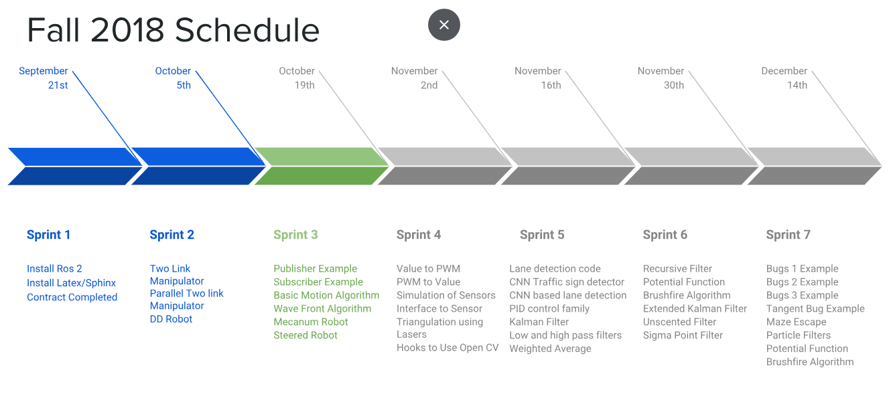
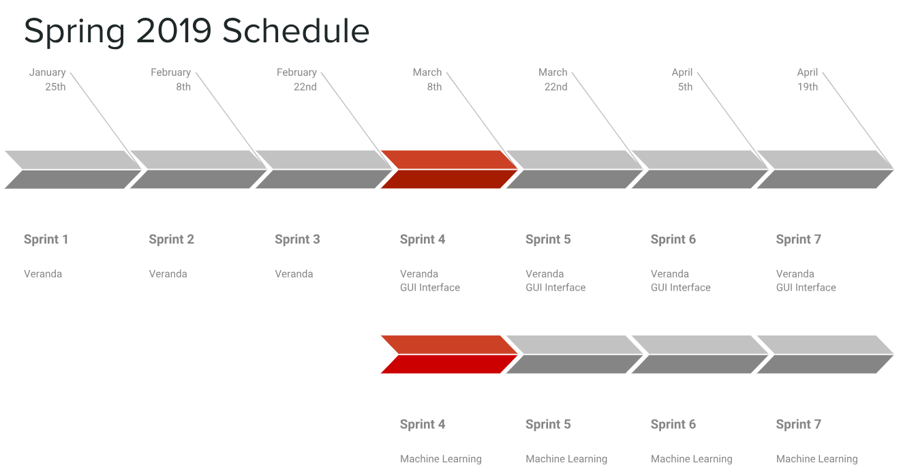

Project Management
==================

This section provides some housekeeping type of information with regard
to the team, project, environment, etc.a

Team Member’s Roles
-------------------

Jeremy Goens    - Developer and Team Lead
Aaron Campbell  - Developer
Soham Naik      - Developer

All members of the team share nearly equally development roles by developing both
source code for the library as well as the documentation and tests. 

As Team Lead, Jeremy was responsible for managing the workflow and setting up meeting
locations and times. He acts as an intermediate scrum master below Dr. McGough.

Project Management Approach
---------------------------

For our project, we decided on an Agile Development methodology with 2
week sprints. This allows for us to work around hectic weeks in our normal
class schedule but keeps a steady pace which ensures work will be done in
a timely manner.

To manage the backlog and sprint assignments, we are using Github's built
in system for project boards. This allows us to follow each algorithm as an
issue and walk it from "Backlog" to "In Progress" to "Up for Code Review" to
"Finished."

The nature of the project allows natural division of the work by algorithm or
book chapter. For main development we will utilize a development branch and will
create feature branches from that development branch. Upon code review and testing, 
these branches will be merged into development and frequently development will be
merged into the master branch.

If a bug is found in either the development or master branch, it will be tracked
as an issue on Github and fixed on a hotfix branch.

Stakeholder Information
------------------------

For this project the stakeholders are people who have invested in the project directly. These would
include members of South Dakota School of Mines and Technology, namely Dr. Jeff McGough
and members of the Robotics team who have helped built RoboScience. Their investment has
primarily been time spent developing the website, book, etc. The senior design group
developing this product also fall under this category as this is their first open-source
contribution and the quality of work will be available for all to see.

Indirect stakeholders would be all students of Robotics who will find themself on RoboScience
for an educational reasons. As users, the ease-of-use and quality of the library will impact their
ability to learn.

Customer or End User (Product Owner)
~~~~~~~~~~~~~~~~~~~~~~~~~~~~~~~~~~~~

The end users would be all students of Robotics who will find themself on RoboScience
for an educational reasons. As users, the ease-of-use and quality of the library will impact their
ability to learn.

As it will be an open source project, the users will have access to the repository. Since 
the customers thoughts on the project should drive the prioritization of the backlog, there 
will be an easy form for users to fill out to provide feedback to the developers. While the
developers may shift as new students take over the repository, Dr. Jeff McGough will serve as
a constant figure within the project for the forseeable future.

Management or Instructor (Scrum Master)
~~~~~~~~~~~~~~~~~~~~~~~~~~~~~~~~~~~~~~~

The Manager of this repository will be the RoboScience organization, and by extention,
Dr. Jeff McGough. For this semester of primary development, he will serve as the overall
Scrum Master with Jeremy acting as an internal driver for the development.

We will meet as a development team between two and three times a week with one being with
Dr. Jeff McGough.

Investors
~~~~~~~~~

There are no financial investors in this project, but the RoboScience Organization has
people who have invested time in it's success, be those professors or students.

Developers – Testers
~~~~~~~~~~~~~~~~~~~~

Of the three developers, each will play multiple roles. Jeremy Goens serves as the
project manager, but all of the developers will serve as designer, developer, and tester
of their individual sections of the project.

The group will serve as a team system's architect by adjusting design choices in our weekly
meetings based on the results of that week's development.

Budget
------

This project has no available funding and, therefore, a budget of $0.

Intellectual Property and Licensing
-----------------------------------

The Intellectual Property will be open-source and not the property of either the stakeholders or
the senior design team. 

As for licensing, this product will be subject to an open-source license which has not been
decided at this time.

Sprint Overview
---------------

If the system will be implemented in phases, describe those
phases/sub-phases (design, implementation, testing, delivery) and the
various milestones in this section. This section should also contain a
correlation between the phases of development and the associated
versioning of the system, i.e. major version, minor version, revision.

All of the Agile decisions are listed here. For example, how do you
order your backlog? Did you use planning poker?

Terminology and Acronyms
------------------------

ROS: Robot Operating System

Provide a list of terms used in the document that warrant definition.
Consider industry or domain specific terms and acronyms as well as
system specific.

Sprint Schedule and Timeline
----------------------------

Development Environment
-----------------------

The development for this project is Ubuntu 16.04 with ROS2 and Python 3.6
installed. 

Our project provides a requirement.txt file which details all the packages
used in development of this library. There will be a setup file within the 
library which will set all of this up for a potential user or developer.

Testing will be accomplished with the Python package "nose." Instructions
on how to run the tests will be included in the library.

Development IDE and Tools
-------------------------

Each developer will be given the option to develop in their editor or IDE of choice,
but the project will be tested via commandline and not an IDE.

Source Control
--------------

The source control used is Git, hosted on Github.com. Git can be installed
via :code:`sudo apt-get install git`
    
If a developer would like to contribute, he or she may do so by submitting either
a bug report or a pull request at the repository site https://github.com/roboscienceorg/robolib.

Dependencies
------------

For the purely Pythonic code, the only dependency is the SciPy stack (Numpy, SciPy, Pandas, Matplotlib, and nose).

For the ROS wrapped code, ROS2 (ardent) is a dependency.

Build Environment
-----------------

The SciPy stack can be installed using the requirements.txt file in repository.
This can be done manually or using the setup file provided.

For the ROS installation, the instructions found at https://github.com/ros2/ros2/wiki/Installation
provide all the necessary information to install on Ubuntu 16.04. This project does not 
guarantee support on other platforms.
